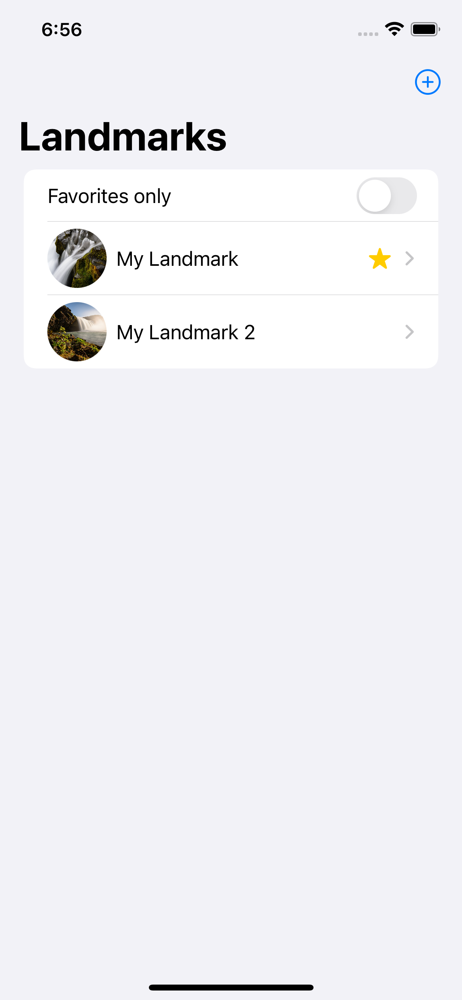
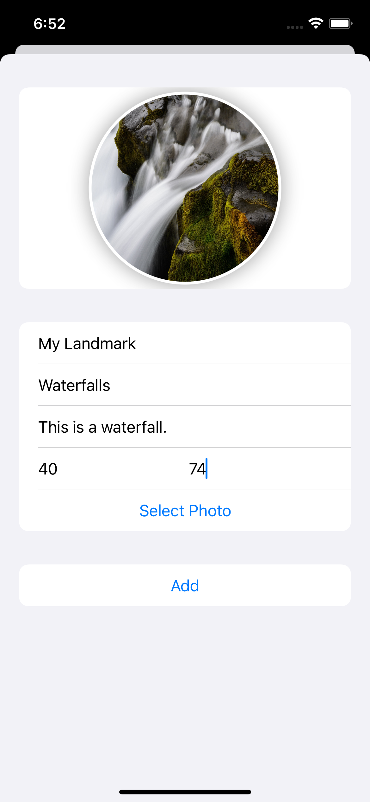
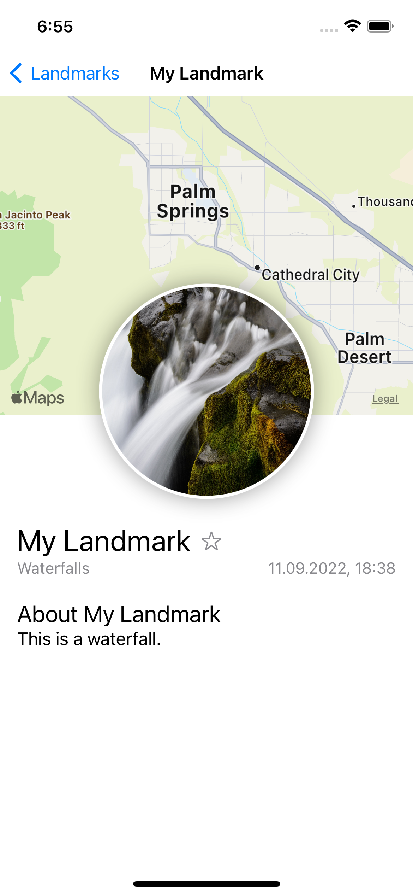

# My Landmarks App (Swift)

## Screenshots

  &nbsp;&nbsp;&nbsp;&nbsp;
  &nbsp;&nbsp;&nbsp;&nbsp;
  

## Features

- CRUD operations with Core Data database
- displaying map with landmarks's location
- filtering list by favorite landmarks
- selecting and saving photo from gallery
